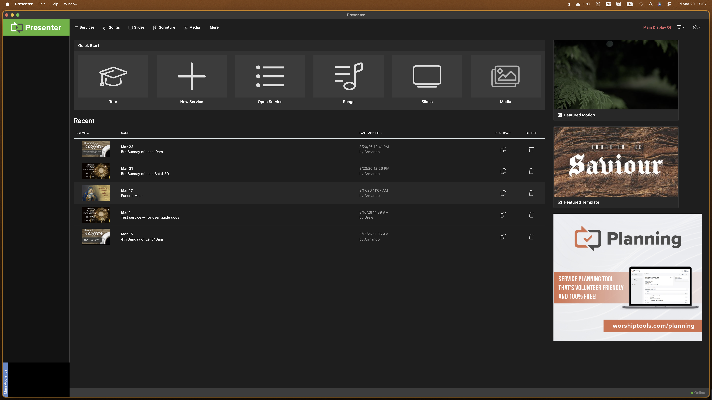

# Launching and starting Presenter

## Arriving at the projection desk

When you open the projection computer, the **Presenter** application
might already be running, or it might have been shut down.

> **Note:** If the computer is on, but the screen is dark, the last
> person to use it might have dimmed the display.
>
> **To brighten (or dim) the display:**
>
> 1. To brighten the display, on the top row of keys, press **F3**.
>     
> 2. To dim the display, press **F2**.
>     
> 3. Adjust the display brightness as needed.

If **Presenter** is not already running, launch the application.

## Start Presenter

On the right side of the display, in the **Dock**, double click the
**Presenter** icon 

**Presenter** will open to the main screen:

